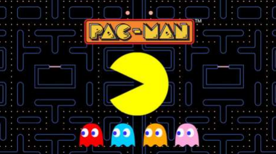

# **Projet Programmation Avancée 2023**
## *Réalisation du jeu PAC-MAN (Namco 1980)*
<br>

### **Objectif du projet**
L'objectif du projet est de réaliser un remake du jeu PAC-MAN (Namco 1980). Le travail s'orientera autour de deux axes : le respect des règles et interface du jeu originel, l'utilisation poussée de C++ moderne.

## Projet réalisé par :


- DEROUSSEAUX Nathanaël
- JARDOT Charles

## Commandes :

### Quick start

```bash
# Compiler les sources
$ make 

# Lancer le jeu
./Pacman
```


## Liens externes


Vous pouvez trouver notre gitlab [ici](https://git.unistra.fr/nderousseaux/projet-programmation-avancee)


<p align="center">
  
</p>